# Active Directory Home Lab

## Project Overview

This home lab demonstrates practical experience with Windows Server, Active Directory Domain Services, domain-joined Windows clients, users and security groups, Organizational Units, password resets, shared folders, NTFS permissions, Group Policy, Windows Firewall, SMB troubleshooting, network drive mapping, and Jira Service Management ticket documentation.

## Lab Environment

- **Domain Controller:** Windows Server
- **Client Machine:** Windows 10/11
- **Hypervisor:** VirtualBox
- **Domain Controller IP:** `192.168.56.10`
- **Client IP:** `192.168.56.20`
- **Primary Services:** Active Directory Domain Services, DNS, Group Policy, SMB file sharing, and Jira Service Management

---

# 1. Active Directory Structure

## Computer Object Verified in Active Directory


This screenshot confirms that the domain-joined Windows client appears as a computer object in Active Directory Users and Computers. A computer account allows the domain controller to identify, authenticate, and centrally manage the device.

## Client Moved to the Workstations OU


I moved the client computer object into the Workstations Organizational Unit. OUs organize directory objects and make it easier to target users and computers with Group Policy.

## Active Directory OU Structure


I created an Organizational Unit structure for users, computers, and departments. This provides cleaner administration and supports department-specific permissions and policies.

## Test Users Created


I created test domain accounts for the Sales and HR departments. These users were used to test authentication, folder permissions, drive mapping, password resets, Group Policy, and access control.

## User Security Group Membership


I added users to the appropriate department security groups. Assigning permissions to groups instead of individual accounts makes access easier to manage and follows common enterprise administration practices.

---

# 2. Password Reset Administration

## Domain User Password Reset

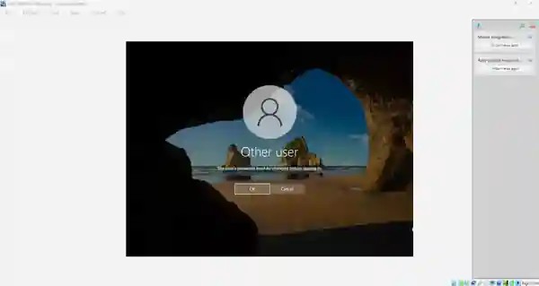

I reset a domain user's password through Active Directory Users and Computers. Password resets are a common help desk task when users forget their credentials or require account recovery.

## Password Change Required at Next Logon

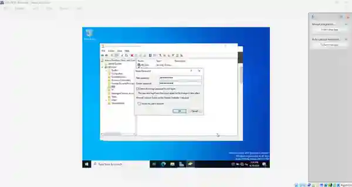

I selected the option requiring the user to change the temporary password at the next sign-in. This ensures that the administrator-created password is used only once and the user creates a private replacement.

---

# 3. Shared Folders, NTFS Permissions, and Drive Mapping

## Sales Folder NTFS Permissions


I configured NTFS permissions on the Sales department folder. Department security groups were used to control access instead of assigning permissions directly to each user.

## Client Accessing Network Shares


The domain-joined client successfully accessed the shared folders hosted on the server. This verified network connectivity, DNS resolution, SMB availability, share permissions, and Windows Firewall configuration.

## Diagnosing a Shared Folder Problem


I investigated a problem where the client could not initially locate or access a network share. Troubleshooting included checking the UNC path, server connectivity, DNS, security-group membership, share permissions, NTFS permissions, Windows Firewall, and TCP port 445.

## Sales Drive Mapped on the Client

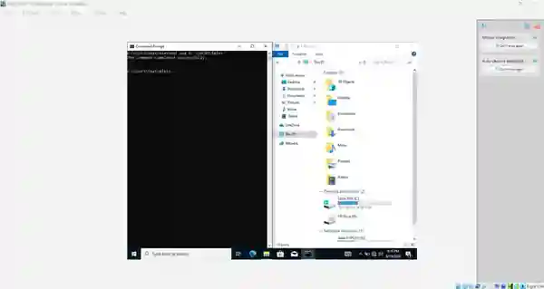

I mapped the Sales shared folder as a network drive on the client. A mapped drive provides a consistent drive letter and makes the resource easier for users to access.

Example:

```powershell
net use S: \\SERVER\Sales
```

## Authorized Sales User Access Confirmed

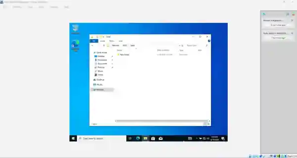

An authorized Sales account successfully opened the Sales shared folder. This confirmed that the Sales security group had the correct share and NTFS permissions.

## HR User Denied Access to the Sales Folder

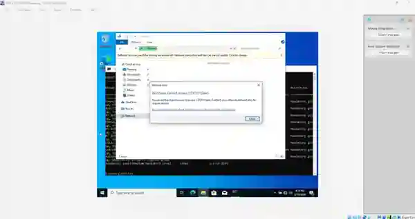

An HR account was denied access to the Sales shared folder as expected. This demonstrates the principle of least privilege by ensuring users can access only the resources required for their department.

---

# 4. Group Policy Configuration

## Sales Control Panel Restriction Configured

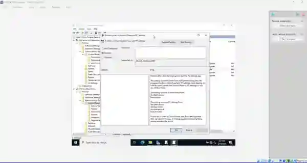

I created a Group Policy Object that prevents Sales users from opening Control Panel and Windows Settings. The policy was linked to the appropriate OU so it would target the intended users.

## Group Policy Verified with GPResult

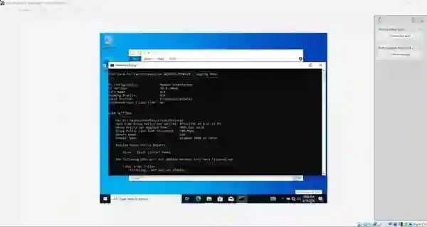

I used `gpresult` to confirm that the Sales Group Policy Object was applied to the signed-in domain user.

```powershell
gpupdate /force
gpresult /r
```

This verification confirmed that the user was in the correct OU, the GPO was linked properly, and Group Policy processing completed successfully.

## Control Panel Successfully Blocked

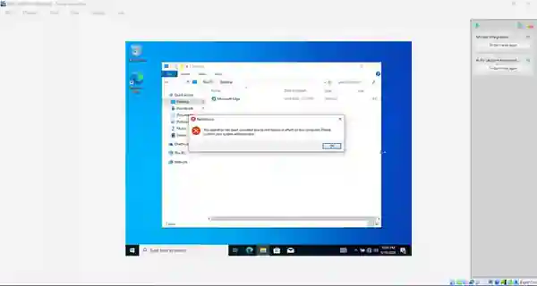

The Sales user attempted to open Control Panel and received a restriction message. This completed the Group Policy test from configuration through end-user validation.

---

# 5. Windows Firewall and SMB Port 445 Testing

## Port 445 Open Before the Firewall Block


Before creating the firewall rule, I confirmed that TCP port 445 was reachable. Port 445 is used by SMB for Windows file and folder sharing.

```powershell
Test-NetConnection 192.168.56.10 -Port 445
```

## Firewall Rule Created to Block Port 445


I created a Windows Defender Firewall rule that intentionally blocked TCP port 445. This simulated a service-specific network problem for troubleshooting practice.

## Port 445 Blocked on the Client


After the firewall rule was applied, the client could no longer connect to SMB port 445. The result demonstrated how a firewall can block one service without disconnecting the computer from the entire network.

## Ping Still Works While Port 445 Is Blocked


The client could still ping the server even though SMB access failed. Ping uses ICMP, while SMB uses TCP port 445, so a successful ping does not prove that every network service is available.

## Port 445 Firewall Rule Removed


I removed or disabled the firewall rule that was blocking TCP port 445.

## Port 445 Connectivity Restored


After removing the rule, I tested port 445 again and confirmed that SMB connectivity and shared-folder access were restored.

---

# 6. Jira Service Management Setup

## Existing Jira Site Selected


I selected my existing Jira site to create a service-management project for documenting help desk incidents associated with the Active Directory lab.

## Basic IT Service Management Template Selected

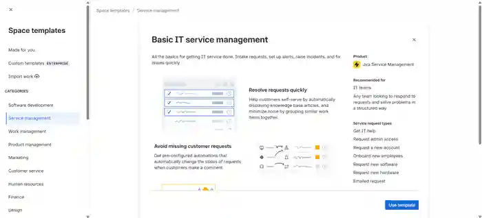

I selected the Basic IT Service Management template. It includes common service-desk functions such as incidents, requests, ticket queues, assignment, status tracking, and resolution documentation.

## IT Service Management Template Reviewed

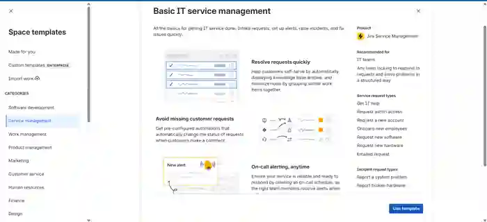

I reviewed the template details to confirm that the workflow supported the help desk scenarios being performed in the lab.

## IT Help Desk Project Configured


I configured the project as an IT Help Desk. The project simulates a professional service desk where technical issues are reported, assigned, investigated, resolved, and documented.

---

# 7. Jira Help Desk Ticket Workflow

## Ticket Received in the Agent Queue

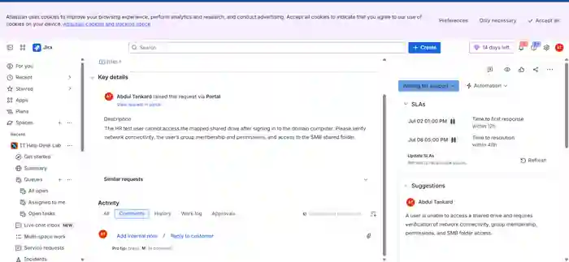

Ticket `ITHD-1` appeared in the agent queue. The reported issue involved a user being unable to access a department network share. I reviewed the issue description, priority, and current status before troubleshooting.

## Ticket Assigned and Investigation Started

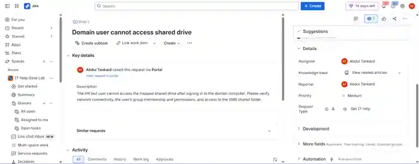

I assigned the ticket to myself and moved it into an active investigation status. Ticket assignment establishes ownership and shows that the incident is being handled.

## Client Connectivity and SMB Diagnostics

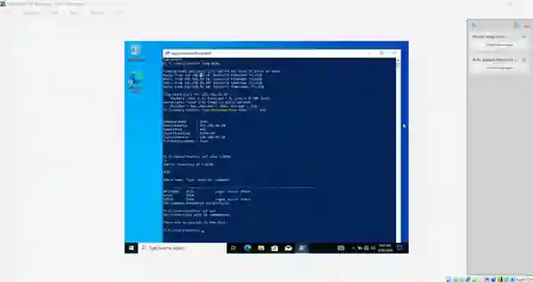

I documented the network and SMB diagnostic work performed from the Windows client. The investigation included connectivity testing, server and share-path verification, TCP port 445 testing, firewall review, and permission checks.

## HR User Access Verified

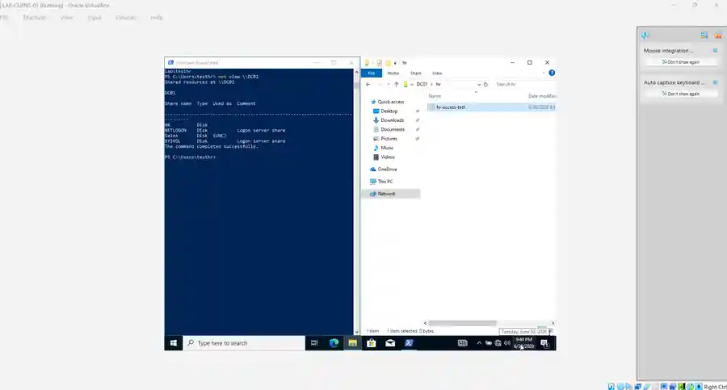

I signed in with an authorized HR domain account and confirmed that the user could access the HR network share. This validated authentication, group membership, share permissions, NTFS permissions, and SMB communication.

## HR Network Drive Mapped

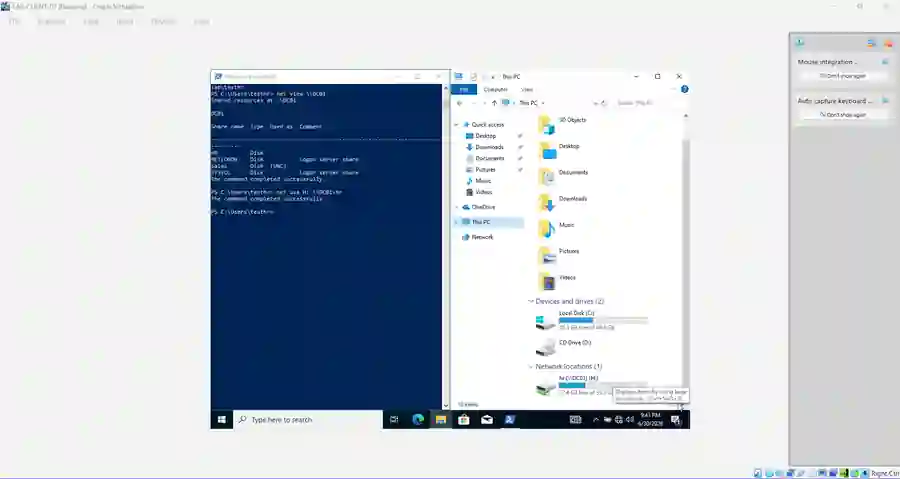

I successfully mapped the HR network share as a drive on the Windows client.

```powershell
net use H: \\SERVER\HR
```

## Sales User Denied Access to the HR Share

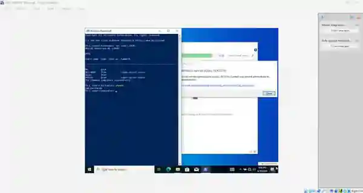

I tested the HR share using a Sales account. Access was denied because the account was not a member of the authorized HR security group, confirming that department-based restrictions were working correctly.

## Jira Ticket Resolved

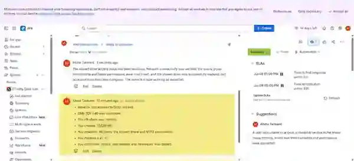

After confirming authorized HR access, successful drive mapping, and proper denial for the Sales account, I documented the resolution and marked the Jira ticket as resolved. This completed the ticket lifecycle from intake through investigation, validation, documentation, and closure.

---

# Skills Demonstrated

- Windows Server administration
- Active Directory Domain Services
- Active Directory Users and Computers
- Domain joins and computer accounts
- Organizational Units
- Domain user creation
- Security-group membership
- Password resets
- Password change at next logon
- Share and NTFS permissions
- Department-based access control
- Network drive mapping
- Group Policy creation and linking
- `gpupdate` and `gpresult`
- Windows Defender Firewall
- SMB and TCP port 445 troubleshooting
- ICMP and ping testing
- PowerShell network diagnostics
- Principle of least privilege
- Jira Service Management
- Ticket queues and assignment
- Incident investigation
- Troubleshooting documentation
- Resolution notes and ticket closure

---

# Useful Commands

```powershell
ipconfig /all
ping 192.168.56.10
nslookup server-name
whoami
whoami /groups
gpupdate /force
gpresult /r
Test-NetConnection 192.168.56.10 -Port 445
net use
net use H: \\SERVER\HR
net use S: \\SERVER\Sales
```

---

# What I Learned

This lab helped me understand how a Windows domain environment is organized, secured, supported, and documented. I practiced managing users, groups, computers, Organizational Units, passwords, network shares, NTFS permissions, mapped drives, Group Policy, and Windows Firewall rules.

I also practiced structured help desk work by documenting a shared-folder incident in Jira Service Management. I received and assigned the ticket, performed connectivity and SMB diagnostics, verified authorized and unauthorized access, mapped the network drive, documented the resolution, and closed the incident.

These tasks reflect common responsibilities performed by help desk technicians, service desk analysts, desktop support technicians, and junior Windows administrators.
