# Active Directory Home Lab Documentation

## Project Overview

This home lab demonstrates hands-on experience with Windows Server, Active Directory Domain Services, user and group administration, shared folders, NTFS permissions, Group Policy, Windows Firewall, SMB troubleshooting, drive mapping, password resets, and Jira Service Management ticket documentation.

The environment includes:

- A Windows Server domain controller
- A Windows client joined to the domain
- Active Directory users, groups, and Organizational Units
- Department-based folder permissions
- Group Policy configuration
- Windows Firewall and SMB troubleshooting
- Jira Service Management help desk ticket documentation

---

# 1. Jira Service Management Setup

## Jira Service Collection Setup


This screenshot shows the initial Jira Service Management setup process. I selected an existing Jira site to create a service management project for documenting help desk incidents and technical support work.

---

## Selecting the IT Service Management Template


I selected the Basic IT Service Management template. This template provides common help desk functions such as incident tracking, service requests, queues, assignments, priorities, status updates, and resolutions.

---

## IT Service Management Template Details


This page displays the features included with the Basic IT Service Management template. I reviewed the available tools before creating the help desk project.

---

## Creating the IT Help Desk Project


I configured the new Jira project as an IT Help Desk. This project is used to document lab issues as if they were real support tickets in a professional service desk environment.

---

# 2. Jira Help Desk Ticket Workflow

## Ticket Received in the Agent Queue


The ticket entered the Jira agent queue as issue `ITHD-1`. The reported problem involved a user being unable to access a shared department folder.

This simulates how a help desk technician receives and reviews a new incident.

---

## Ticket Assigned and Investigation Started


I assigned the ticket to myself and changed the status to indicate that troubleshooting had started.

This demonstrates ticket ownership and proper incident status management.

---

## Client Connectivity and SMB Diagnostics


I performed connectivity and SMB diagnostics from the Windows client.

The troubleshooting process included:

- Confirming communication with the domain controller
- Testing network connectivity
- Verifying the server name and IP address
- Checking access to the shared folder
- Confirming SMB availability
- Reviewing whether Windows Firewall was blocking port 445

Port 445 is used by SMB for Windows file and folder sharing.

---

## HR User Access Verified


I signed in as an authorized HR user and confirmed that the account could access the HR shared folder.

This verified that the user account, group membership, share permissions, and NTFS permissions were configured correctly.

---

## HR Drive Successfully Mapped


The HR shared folder was mapped as a network drive on the Windows client.

Mapping a network drive gives the user a consistent drive letter and makes the shared resource easier to access.

---

## Unauthorized Sales User Denied Access


I signed in as a Sales user and attempted to access the HR shared folder.

Access was denied as expected because the Sales account was not a member of the authorized HR security group.

This confirms that department-based access control was working correctly.

---

## Jira Ticket Resolved


After verifying the solution, I added the resolution details and marked the Jira ticket as resolved.

The resolution documented:

- The reported issue
- Troubleshooting steps
- Connectivity testing
- Permission verification
- Successful drive mapping
- Authorized user access
- Unauthorized user access denial
- Final resolution and closure

This demonstrates the complete help desk ticket lifecycle from creation to resolution.

---

# 3. Active Directory Structure

## Computer Object Verified in Active Directory


This screenshot confirms that the Windows client computer object appears in Active Directory Users and Computers.

When a computer joins a domain, Active Directory creates a computer account that allows the domain controller to identify and manage the device.

---

## Client Moved to the Workstations OU

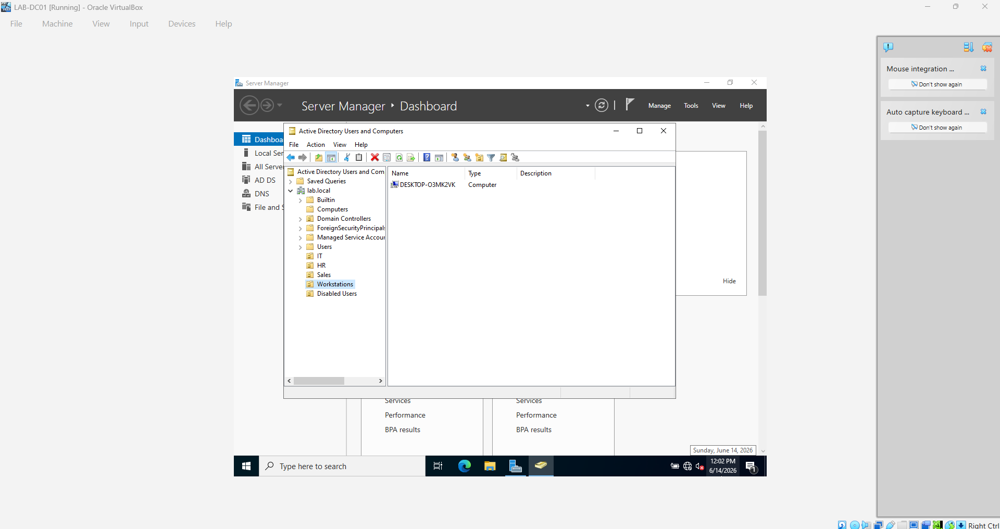

I moved the Windows client computer object into the Workstations Organizational Unit.

Organizational Units help organize Active Directory objects and allow administrators to apply Group Policy settings to specific users or computers.

---

## Active Directory OU Structure

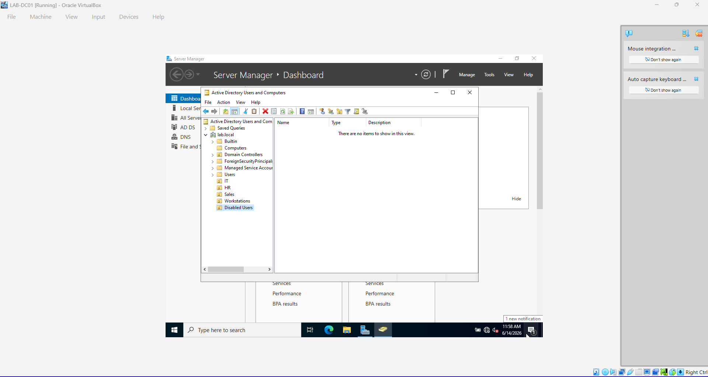

This screenshot shows the Organizational Unit structure created for the lab.

The OUs separate users, computers, and departments into logical containers. This makes administration, delegation, and Group Policy management easier.

---

## Test Users Created

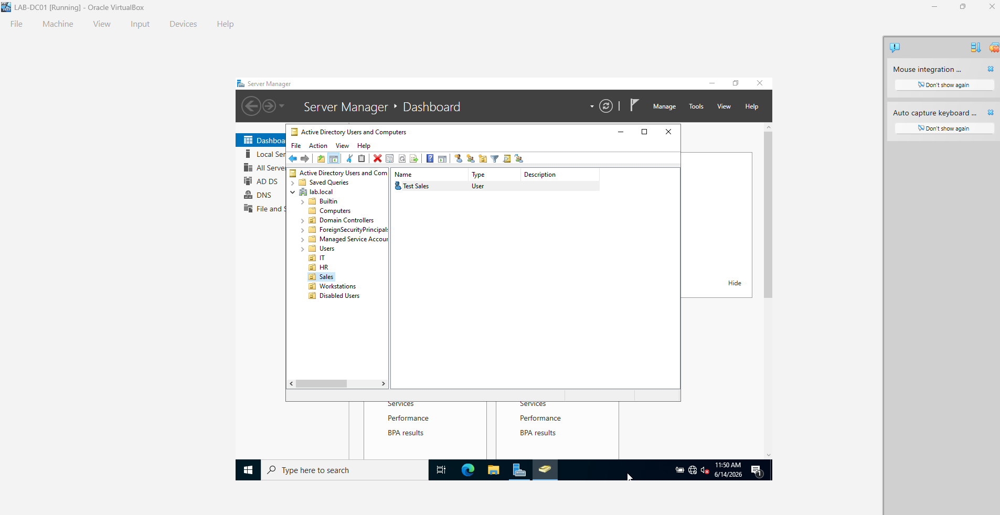

I created test domain user accounts for multiple departments.

These accounts were used to test:

- Domain authentication
- Security group membership
- Shared folder permissions
- Group Policy
- Authorized access
- Unauthorized access
- Password resets

---

## User Security Group Membership

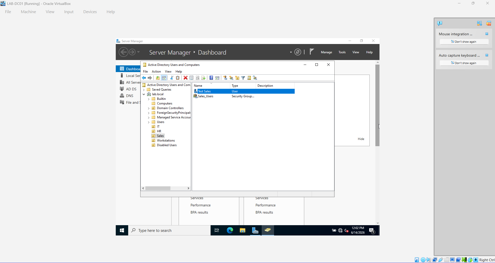

This screenshot shows a user being added to the appropriate department security group.

Security groups simplify permission management. Instead of assigning folder permissions to each user individually, permissions can be assigned to a group and users can be added or removed from that group.

---

# 4. Password Reset Administration

## Password Reset Configuration


I reset a domain user's password through Active Directory Users and Computers.

The account was configured so the user would be required to change the temporary password after signing in.

This is a common help desk procedure when a user forgets a password or requires account recovery.

---

## User Must Change Password at Next Logon


This screenshot shows the option requiring the user to change the password at the next sign-in.

This protects the account because the administrator-created temporary password is only used once. The user then creates a private password that the administrator does not know.

---

# 5. Shared Folder and NTFS Permissions

## Sales Folder NTFS Permissions

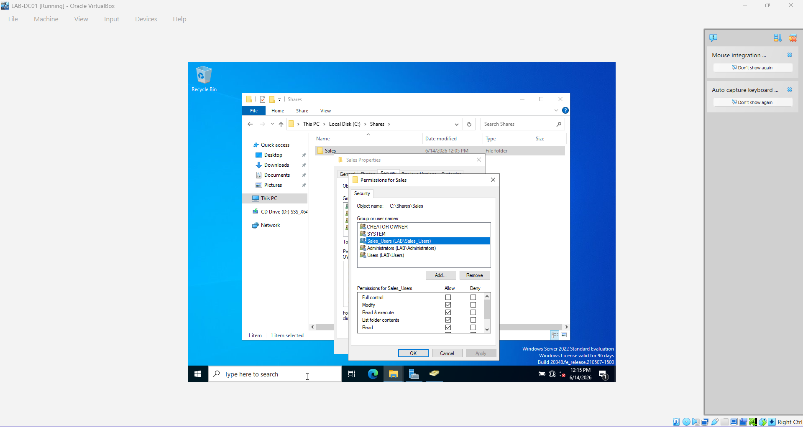

I configured NTFS permissions on the Sales department folder.

NTFS permissions control access to files and folders stored on a Windows file system. Department security groups were used to determine which users could access the resource.

---

## Client Accessing Network Shares

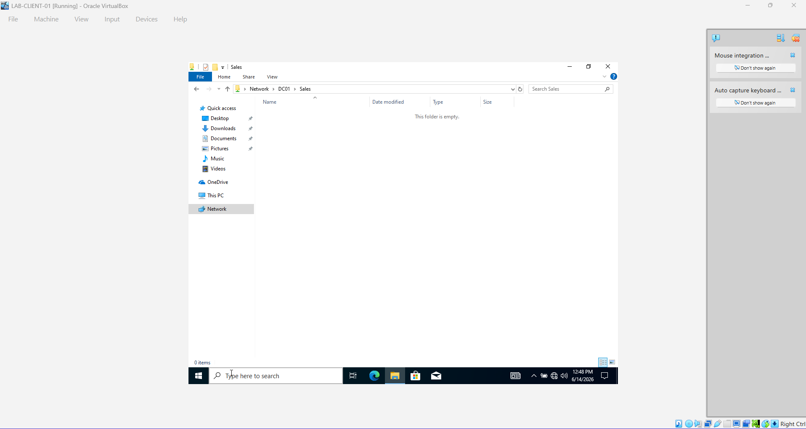

The Windows client successfully connected to the shared folders hosted on the server.

This confirmed that:

- The client could reach the server
- DNS resolution was working
- SMB was available
- Share permissions were configured
- Windows Firewall allowed the connection

---

## Diagnosing the Missing Shared Folder


This screenshot documents troubleshooting performed when the client could not initially locate or access the shared folder.

The investigation included checking:

- The correct UNC path
- Server connectivity
- DNS resolution
- Share configuration
- User permissions
- Security group membership
- Windows Firewall
- SMB port 445

---

## Sales Drive Mapped on the Client


The Sales department shared folder was successfully mapped as a network drive on the client computer.

A mapped drive provides users with a simple drive letter instead of requiring them to enter the full UNC path each time.

---

## Authorized Sales User Folder Access


An authorized Sales user successfully accessed the Sales shared folder.

This confirmed that the user was a member of the correct security group and that both share and NTFS permissions were configured properly.

---

## HR User Denied Access to Sales Folder


An HR user attempted to access the Sales folder and received an access denied message.

This demonstrates the principle of least privilege. Users receive access only to resources required for their job responsibilities.

---

# 6. Group Policy Configuration

## Sales Control Panel Restriction Configured


I created and configured a Group Policy Object that prevents Sales users from opening the Windows Control Panel and Settings application.

The GPO was linked to the appropriate Organizational Unit so it would apply only to the intended users.

---

## Group Policy Applied with GPResult


I used the `gpresult` command to confirm that the Sales Group Policy was applied to the signed-in user.

```powershell
gpresult /r
```

This command displays the Group Policy Objects applied to the current computer and user.

---

## Control Panel Successfully Blocked


The Sales user attempted to open Control Panel and was blocked by the configured Group Policy.

This confirmed that:

- The GPO was created correctly
- The policy was linked to the correct OU
- The user was located in the correct OU
- Group Policy updated successfully
- The restriction functioned as expected

---

# 7. Windows Firewall and SMB Port 445 Testing

## Port 445 Open Before Firewall Block

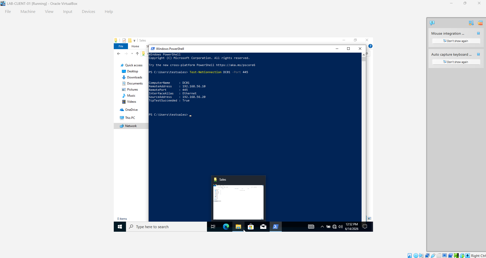

Before creating the firewall rule, I tested connectivity to SMB port 445.

Port 445 was reachable, confirming that Windows file sharing was available between the client and server.

```powershell
Test-NetConnection 192.168.56.10 -Port 445
```

---

## Firewall Rule Created to Block Port 445

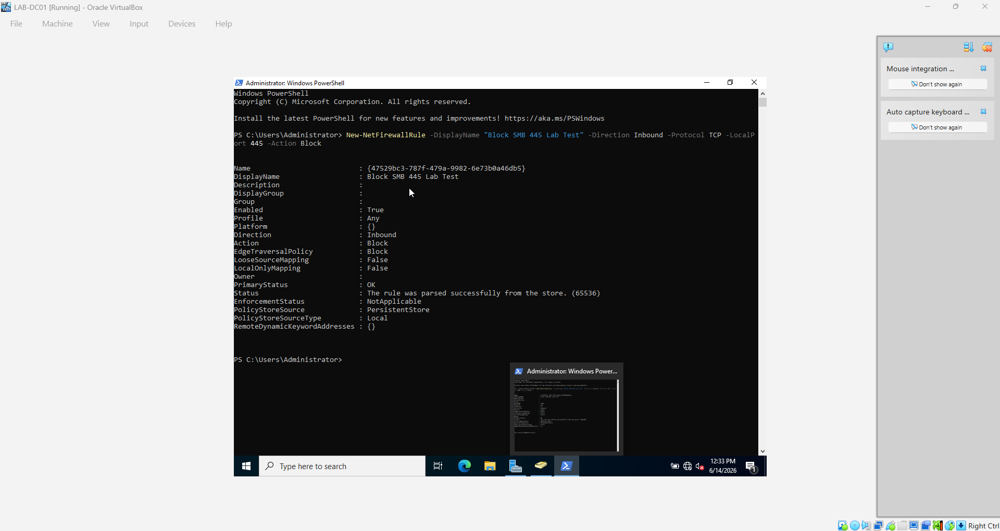

I created a Windows Defender Firewall rule to block TCP port 445.

This intentionally interrupted SMB file-sharing traffic so I could practice diagnosing a network service that was unavailable while other network communication still worked.

---

## Port 445 Blocked on the Client

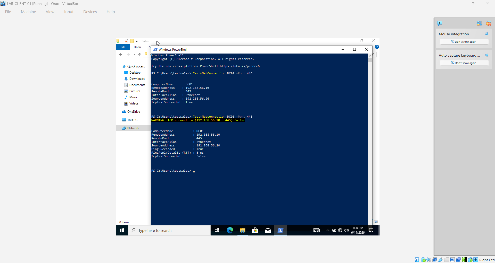

After applying the firewall rule, the client could no longer connect to SMB port 445.

This demonstrated how a firewall can block a specific application or service without disconnecting the computer from the entire network.

---

## Ping Still Works While Port 445 Is Blocked

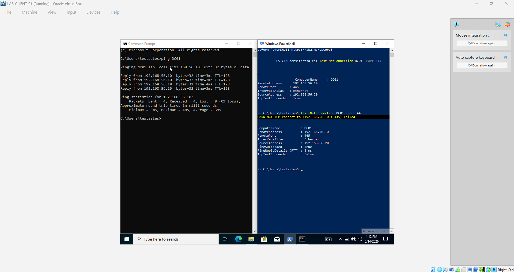

The client could still ping the server even though SMB access failed.

Ping uses ICMP, while SMB uses TCP port 445. This demonstrates why a successful ping does not guarantee that every network service is available.

---

## Port 445 Firewall Rule Removed

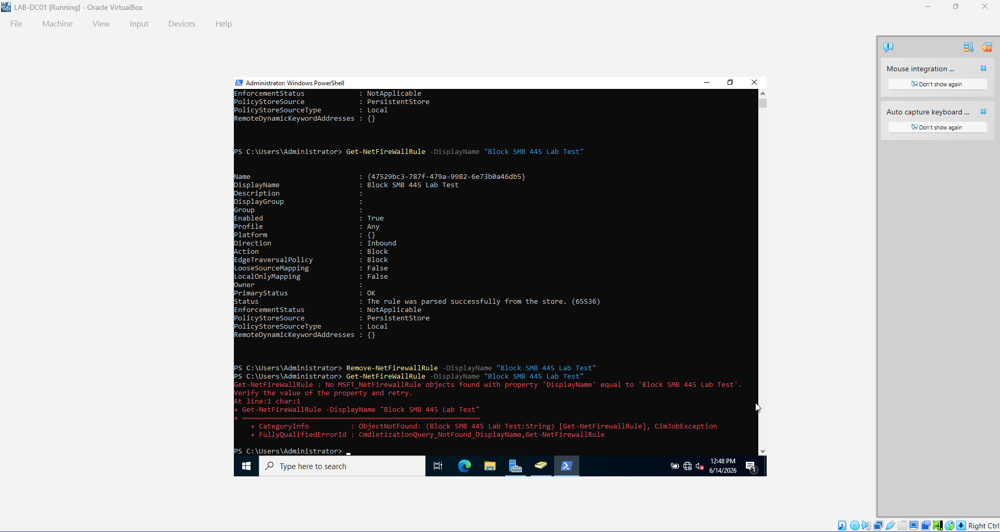

I removed or disabled the firewall rule that was blocking TCP port 445.

Removing the rule allowed SMB traffic to reach the server again.

---

## Port 445 Connectivity Restored

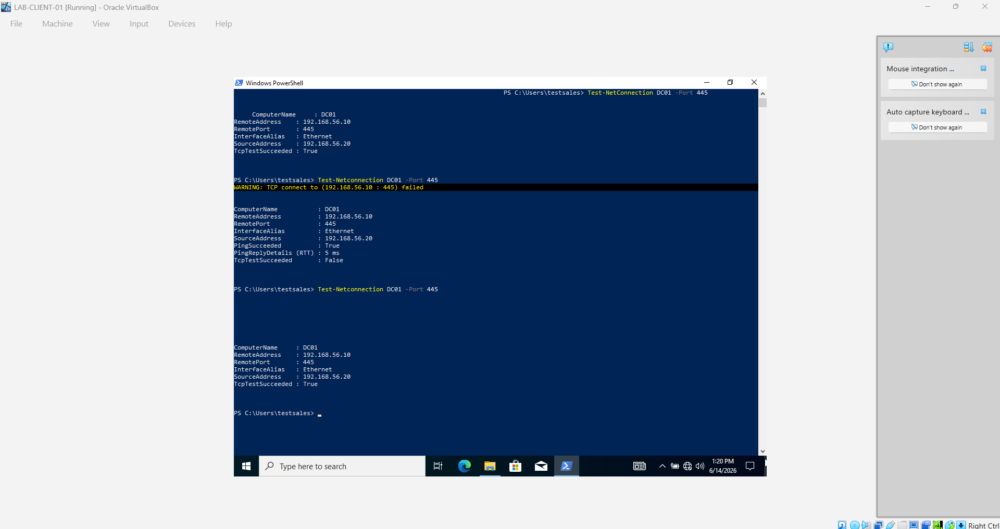

After removing the firewall restriction, I tested port 445 again and confirmed that connectivity was restored.

The shared folders became accessible again, completing the troubleshooting process.

---

# Skills Demonstrated

This project demonstrates practical experience with:

- Windows Server administration
- Active Directory Domain Services
- Active Directory Users and Computers
- Domain user creation
- Computer account management
- Organizational Units
- Security groups
- Password resets
- User account recovery
- Group membership management
- Shared folder configuration
- NTFS permissions
- Share permissions
- Network drive mapping
- Group Policy creation
- Group Policy troubleshooting
- `gpupdate`
- `gpresult`
- Windows Defender Firewall
- SMB file sharing
- TCP port 445
- ICMP and ping testing
- PowerShell network diagnostics
- Access control testing
- Principle of least privilege
- Jira Service Management
- Ticket assignment
- Incident investigation
- Troubleshooting documentation
- Resolution notes
- Ticket closure

---

# Useful Commands

```powershell
ipconfig /all
ping 192.168.56.10
nslookup server-name
whoami
whoami /groups
gpupdate /force
gpresult /r
Test-NetConnection 192.168.56.10 -Port 445
net use
```

---

# What I Learned

This lab helped me understand how Windows domain environments are managed and supported.

I practiced creating users, groups, computers, and Organizational Units in Active Directory. I also configured shared folders, tested department-based permissions, mapped network drives, created Group Policy restrictions, reset user passwords, and diagnosed SMB connectivity problems involving Windows Firewall and TCP port 445.

Using Jira Service Management allowed me to document the technical issue as a complete help desk ticket. I recorded the problem, assigned the ticket, performed troubleshooting, verified the solution, documented the resolution, and closed the incident.

This project reflects common responsibilities performed by help desk technicians, desktop support specialists, service desk analysts, and junior system administrators.
