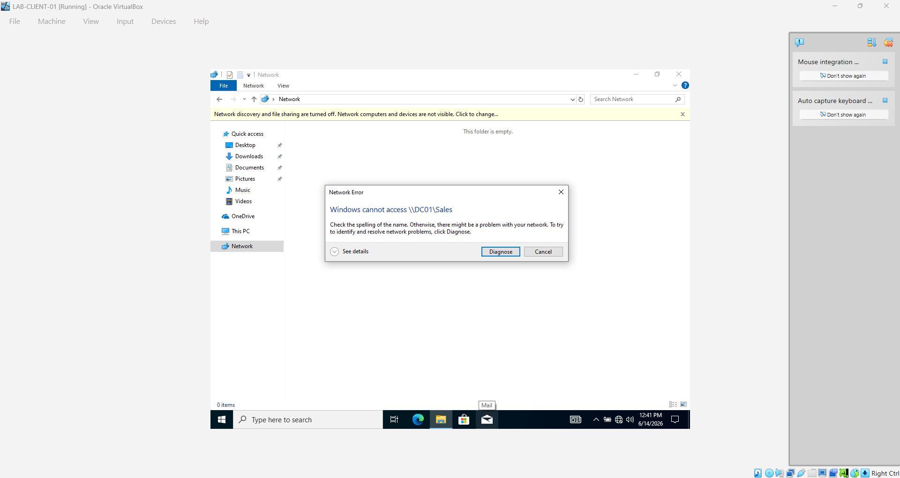

# Active Directory Home Lab

## Lab Goal
The goal of this lab is to practice Windows Server, Active Directory, domain joins, users, groups, shared folders, Group Policy, ports, remote logins, and basic network troubleshooting.

## Lab Environment
- **Domain Controller:** Windows Server
- **Client Machine:** Windows 10/11
- **Hypervisor:** VirtualBox
- **Domain Name:** 
- **Network Type:** 
- **Admin Account:** 

## Skills Practiced
- Installed and configured a Windows Server domain controller
- Joined a Windows client to a domain
- Verified the client inside Active Directory
- Created Organizational Units
- Created test domain users
- Created groups
- Practiced shared folder access
- Planned Group Policy testing
- Practiced basic networking commands
- Planned remote access testing with RDP, SSH, VNC, ports, and port forwarding

## Lab Notes

### 1. Domain Join

**What I did:**  
I joined a Windows client machine to my Active Directory domain.

**Why this matters:**  
Joining a computer to a domain allows centralized login, management, and security through Active Directory.

**Tools/commands used:**

```powershell
sysdm.cpl
ipconfig /all
whoami
```

## Screenshots

### Active Directory OU Structure


### Client Moved to Workstations OU


### User Group Membership


### Test Users Created


### Computer Object Proof


### Sales Folder NTFS Permissions


### Client Accessing Shares


### Diagnosing Shared Folder Issue


### Port 445 Open Before Firewall Block


### Port 445 Blocked on Client


### Port 445 Blocked but Ping Still Works


### Port 445 Firewall Rule


### Firewall 445 Removed


### Port 445 Restored


## Lab Checkpoint 1: Active Directory Foundation

### Status
Completed initial Active Directory setup and basic domain organization practice.

### Completed Tasks
- Set up a Windows Server domain controller.
- Opened Active Directory Users and Computers.
- Created Organizational Units for lab organization.
- Practiced creating test users and groups.
- Practiced assigning shared folder permissions.
- Practiced Windows Firewall rule changes by temporarily blocking port 445.
- Restored port 445 after testing.

### Tools Used
- Server Manager
- Active Directory Users and Computers
- Windows Defender Firewall with Advanced Security
- PowerShell
- File Explorer
- Shared Folder permissions
- NTFS Security permissions

### Key Concepts Practiced

#### Organizational Units
Organizational Units help organize Active Directory objects like users, computers, groups, and servers. They also make it easier to apply Group Policy.

#### Groups and Permissions
Groups are used to manage access to resources. Instead of assigning permissions to each user individually, users can be placed into groups and permissions can be assigned to the group.

#### Share vs NTFS Permissions
Share permissions control access over the network. NTFS permissions control access at the file system level. When both apply, the most restrictive permission usually wins.

#### Port 445 Practice
Port 445 is used by SMB for Windows file sharing. Blocking it can stop access to shared folders over the network. Restoring it allows file sharing to work again.

### Screenshot Notes
Screenshots captured:
- Active Directory OU structure
- Test users and groups
- Shared folder permissions
- NTFS security permissions
- Firewall rule for port 445
- Client access to shared folders

### What I Learned
This checkpoint helped me understand how Active Directory organizes users, computers, and groups. I also practiced how permissions work for shared folders and how firewall rules can affect network file sharing.
